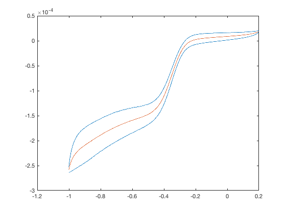

# CORRECT


**CORRECT** 是一个意在简化科思特公司的电化学工作站生成的.cor格式文件的数据处理的MATLAB项目.


##函数

#### corRead()

读取.cor文件内容,并将数据转为可在MATLAB中使用的格式.

- 使用

```
data = corRead(filePath,dataFormat,column,verbose)
```

- 说明

    - `filePath`:文件地址
    - `dataFormat`:一行的数据的格式
    - `column`:数据列数
    - `verbose`:(可省略),是否显示注释 

    
    ===
    - `data`:存有最终数据的结构体,其域分别为`.circle1`,`.circle2`,...

- 例子 

`400rpm -1-0.2 O2.cor.cor`文件内容如下(...省略部分数据):

```
CORRW ASCII
CorrTest for Windows: SN CS3501410110  V5.1.21.5  V3.24g.01.17
ID_CV
Data:2017-04-22   Time:14:03:09
Cyclic Voltammetry,Init E(V):-1,Low E(V):0.2,High E(V):-1,Scan Rate(mV/s):10,FRQ(Hz):20,Cycles:2,Measuring time(s):960
Open Circuit Potential (V):-0.1997672

Temperature(℃):   25
  Begin Information:            Cell Information
      Surface Area:           1
      Density:                7.8
      Weight:                 28
      Polarity:               0
      PolarityI:              0
      Corrosion Unit Type:    1
      Reference Type:         2
      Reference Potential:    0
      Reference User-Defined: 2
      Stern-Geary:            18
  End Information:              Cell Information
  Begin Experiment:
      Axes Type:              3
  End Experiment:
E(V)		i(A/cm^2)		T(s)
End Comments
-9.97317E-01	-3.38364E-04	0.0000
-9.96817E-01	-3.36524E-04	0.0500
...
-1.00023E+00	-2.55731E-04	239.4600
-1.00072E+00	-2.55775E-04	239.5100  0 CYCLE
-1.00061E+00	-2.53141E-04	239.5600
...
-1.00050E+00	-2.63891E-04	479.3065  1 CYCLE
```
运行

```
data = corRead('400rpm -1-0.2 O2.cor','%f %f %f',3)
```
结果

```
data = 

  包含以下字段的 struct:

    circle1: [4791×3 double]
    circle2: [4797×3 double]
```

---

#### meanOfCircle()

计算循环一圈中的平均值.

- 使用


```
[ meanY,tx ] = meanOfCircle( circleData,xIndex,yIndex )
```

- 说明

    - `circleData` : 一圈的数据,即`corRead.circleN`
    - `xIndex` : 横轴物理量在`circleData`中的所在列数
    - `yIndex` : 纵轴物理量在`circleData`中的所在列数

    
    ===
    - `meanY` : 计算后的纵轴物理量平均值
    - `tx` : `meanY`所对应的横轴物理量取值

- 例子

设现有从`corRead()`中获取的第二圈数据:

```
c2 = corRead('400rpm -1-0.2 O2.cor','%f %f %f',3).circle2
```
其第一列为电压,第二列为电流密度,第三列为时间.

```
[yy,xx]=meanOfCircle(c2,1,2);
```
将原始数据,与平均值画图如下:
红色为平均值,蓝色为原始数据.



---
#### meanOfCircleAtPoint()

计算一圈中某横坐标值对应的平均纵轴值

- 使用

```
meanY = meanOfCircleAtPoint( x,circleData,xIndex,yIndex )
```

- 说明

    - x : 待计算的横坐标值
    - `circleData` : 一圈的数据,即`corRead.circleN`
    - `xIndex` : 横轴物理量在`circleData`中的所在列数
    - `yIndex` : 纵轴物理量在`circleData`中的所在列数

    
    ===
    - `meanY` : 计算后的纵轴物理量平均值
- 例子

设现有从`corRead()`中获取的第二圈数据:

```
c2 = corRead('400rpm -1-0.2 O2.cor','%f %f %f',3).circle2
```
其第一列为电压,第二列为电流密度,第三列为时间.欲求电压为-0.6V时的电流密度:

```
j=meanOfCircle(-0.6,c2,1,2);
```
---


