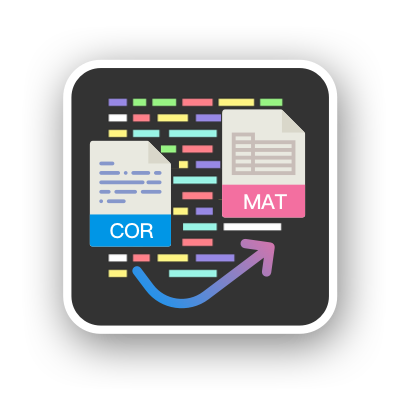

# CORRECT

**CORRECT** 是一个意在简化科思特公司的电化学工作站生成的.cor格式文件的数据处理的MATLAB项目.

## 使用/Usage

- 下载并解压缩至你的工作区.
- 将解压文件夹中的**`functions`**文件夹添加至MATLAB的搜索路径中.

## 函数/Functions

### 基础函数
- **[corRead( )](docs/corRead.md)** 读取`.cor`文件
- **[meanOfCircle( )](docs/meanOfCircle.md)** 计算一圈数据均值.
- **[meanOfCircleAtPoint( )](docs/meanOfCircleAtPoint.md)** 计算一圈中某点均值.

- **[plotCircle( )](docs/plotCircle.md)** 将不同圈数数据画在同一张图中,并以渐变着色.

### 功能函数

#### 计算电子转移数
- **[calcNbyLevich( )](docs/calcNbyLevich.md)** 利用Koutecký-Levich方程斜率计算转移电子数.
- **[calcNbyjw( )](docs/calcNbyjw.md)**利用最小二乘法拟合1/j~ω^-0.5 的斜率然后利用[calcNbyLevich( )](docs/calcNbyLevich.md)计算转移电子数.
- **[calcNfromFiles( )](docs/calcNfromFiles.md)** 由不同转速下测得的多个`.cor`文件计算电子转移数.

