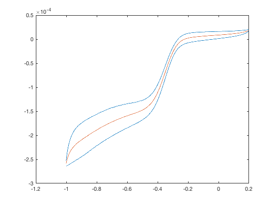

# meanOfCircle

计算循环一圈中的平均值.

- 使用


```
[ meanY,tx ] = meanOfCircle( circleData,xIndex,yIndex,xRange )
```

- 说明

    - `circleData` : 一圈的数据,即`corRead.circleN`
    - `xIndex` : 横轴物理量在`circleData`中的所在列数
    - `yIndex` : 纵轴物理量在`circleData`中的所在列数
    - `xRange` : 指定插值范围,可省略.

    
    ===
    - `meanY` : 计算后的纵轴物理量平均值
    - `tx` : `meanY`所对应的横轴物理量取值

- 例子

设现有从`corRead()`中获取的第二圈数据:

```
c2 = corRead('400rpm -1-0.2 O2.cor','%f %f %f',3).circle2
```
其第一列为电压,第二列为电流密度,第三列为时间.

```
[yy,xx]=meanOfCircle(c2,1,2);
```
将原始数据,与平均值画图如下:
红色为平均值,蓝色为原始数据.


