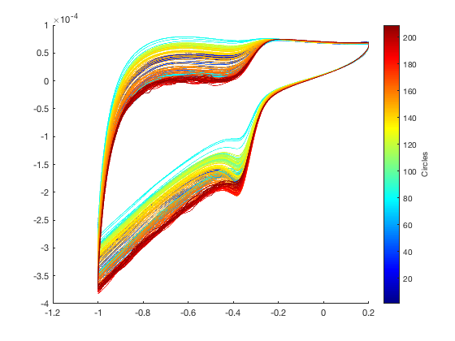

# plotCircle
将不同圈数数据画在同一张图中,并以渐变着色.

- 使用

```matlab
h = plotCircle( data,xIndex,yIndex,circles,colormapName )
```


- 说明

    - `data` : 包含不同圈数的数据结构体
    - `xIndex` : 横轴所在列,默认为1
    - `yIndex` : 轴轴所在列,默认为2
    - `circles` : 圈数范围,默认为全部
    - `colormapName` : 渐变方案,默认为`jet`

    ---
    
    - h : 图像句柄

    

- 例子

设现有数据`data`包含了1~209圈的数据:

```
data = 

  包含以下字段的 struct:

      circle1: [4778×3 double]
      circle2: [4776×3 double]
      circle3: [4777×3 double]
      ...
      circle208: [4776×3 double]
      circle209: [4777×3 double]
```

运行

```matlab
plotCircle(data);
% 当输入参数只有一个data时,其他参数将使用默认值
```

结果如图:


